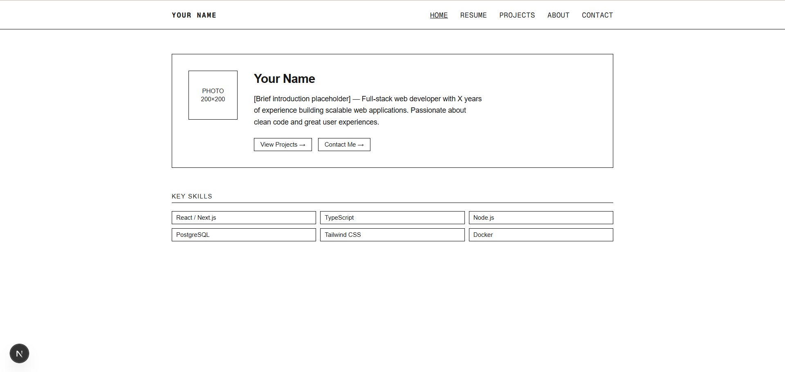

# Personal Portfolio Template

A low-fidelity personal portfolio template built with **Next.js**, **React**, and **TypeScript**. Minimal setup, easy to customize. Just fork and make it yours!

---

<!-- Place a screenshot of your portfolio here -->
<!-- Recommended: 1200x630px, saved as /public/preview.png -->



---

## Features

- Built with Next.js, React, and TypeScript
- Low-fidelity, minimal design
- Pre-built sections for bio, projects, and contact
- Responsive layout out of the box
- Clean folder structure, ready to extend

---

## Getting Started

### Prerequisites

- [Node.js](https://nodejs.org/)
- npm, yarn, or pnpm

### Installation

1. Clone the repository:

```bash
   git clone https://github.com/your-username/portfolio-template.git
   cd portfolio-template
```

2. Install dependencies:

```bash
   npm install
```

3. Start the development server:

```bash
   npm run dev
```

4. Open [http://localhost:3000](http://localhost:3000) in your browser.

---

## License

This project is licensed under the [MIT License](LICENSE).
